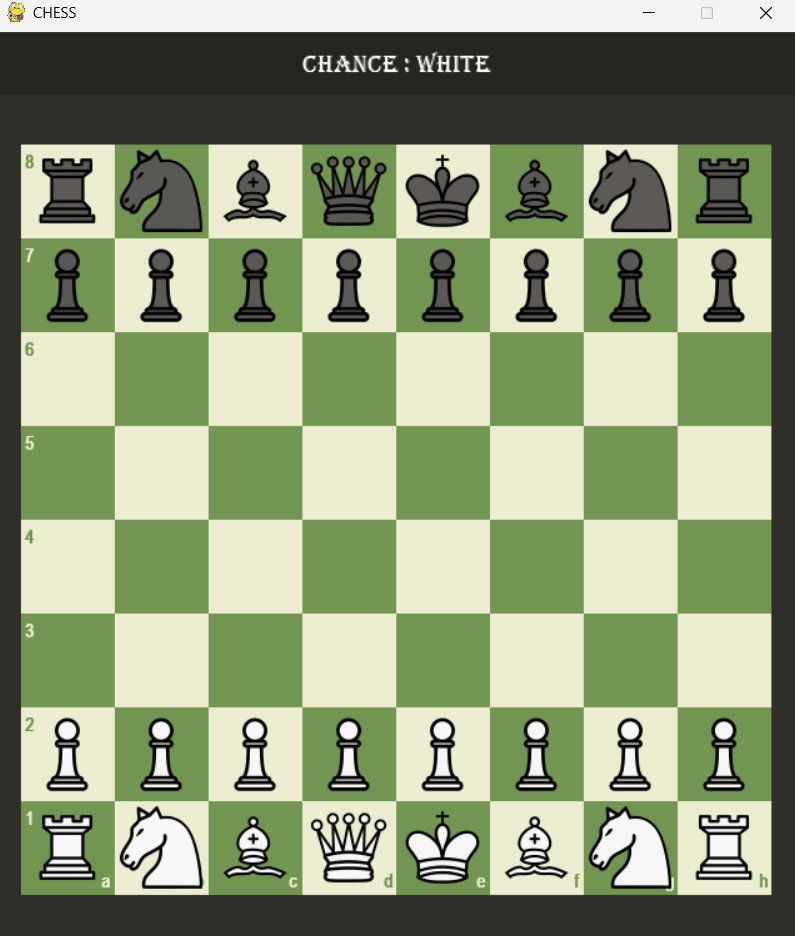
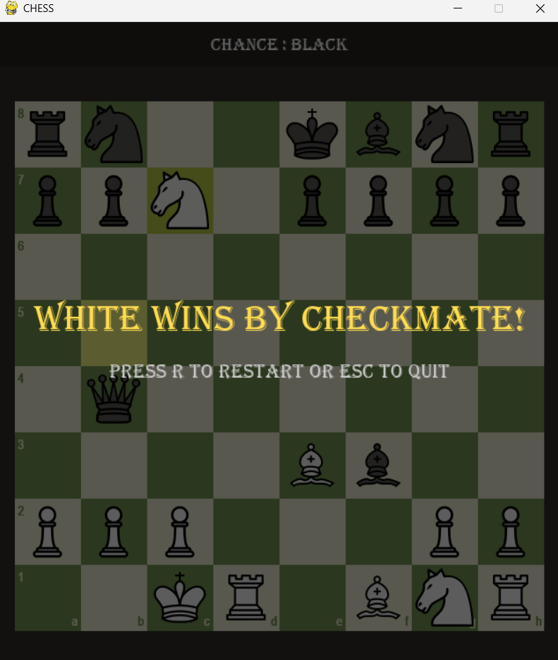

# Chess Game (Python + Pygame)

A fully playable Chess game built using Python and Pygame, featuring legal move validation, special chess rules, and game-ending conditions.

---

## 🎮 Features
- Complete chess board with graphical interface
- Legal move generation for all pieces
- Check detection
- Checkmate detection
- Stalemate detection
- Castling (King-side and Queen-side)
- En Passant
- Pawn Promotion
- Move highlighting
- Last move highlighting
- Game over screen with restart option

---

## 🛠️ Technologies Used
- Python 3
- Pygame

---

## ⚙️ Installation
Clone the repository:
```bash
git clone https://github.com/Krishnabansal28/Chess-Game.git
```
Navigate to the project directory:
```bash
cd Chess-Game
```
Install dependencies:
```bash
pip install -r requirements.txt
```
Run the game:
```bash
python main.py
```

## 🎮 Controls
| Key / Action | Function |
| --- | --- |
| Mouse Click | Select and move pieces |
| R | Restart game after game over |
| Q | Abort current game |
| ESC | Exit game |

## 📸 Screenshots
### Initial Board

### Checkmate


## ♟️ Implemented Chess Rules
- Standard piece movement
- Capturing
- Check detection
- Checkmate detection
- Stalemate detection
- Castling
- En Passant
- Pawn Promotion

## 🚀 Future Improvements
- Move history panel
- Undo move feature
- PGN export/import
- Chess clock
- AI opponent using Minimax algorithm
- Online multiplayer support

## 👨‍💻 Author

Krishna Bansal

If you found this project interesting, feel free to ⭐ star the repository.
